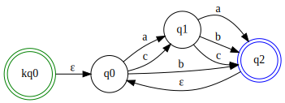

# FA有限自动机

## 特征
主要特征有：
1. 它是一种描述能力和资源要求及其有限的计算模型。 
1. 它定义状态集合和符号集合，并定义某个状态在遇到一些符号(甚至NFA允许空符号）时转移到哪个状态的规则列表。
1. 务必注意！！我们应该把状态视作为一个对象，它不仅仅是一个int数字，它可以是一个复合对象，同理，符号也可以是抽象的（而不限于是一个字符）。这在证明一些正则语言的正则运算方面非常有用，比如正则语言的并运算所需要的有限状态机中，状态可以用pair(Q1, Q2)这个序对来表达。
当然，你可以自行选择在某些时候将复杂形式的状态类型转换为字符串形式或者Int数字形式的都行（总之，无论什么类型去表达，都是“状态”对象），只要整个状态机下的状态不存在冲突即可。
1. 在执行计算时，它只需有限的内存记录当前的状态。当然，它却可以处理无限的输入。
1. 它分为两类：DFA（确定性有限状态机）和NFA（非确定性有限状态机）。

## DFA确定性有限状态机
1. 有限的状态集合
1. 有限的字母表。
1. 有一个状态集合X字母表的笛卡尔积转移函数表，即转换规则，它定义了每一个状态在遇到每一个字母时将转移到哪个状态（当然，允许转移到原状态）（从定义中的笛卡尔积可知，它不存在二义性：不会存在一个状态遇到一个字母的多个转换。也不存在缺失性：即每个状态下都能处理每一个字母作为输入而得到下一个状态）
1. 有一个起始状态。
1. 有一个可接受状态集合，也叫终结状态。

## NFA非确定性有限状态机
1. NFA与DFA的差别在于它的状态转移函数表不存在DFA中的两个约束，即NFA允许相同(状态,输入符号)序对转移到多个不同的状态，而且允许不存在某个(状态,输入符号)序对的转移，
1. 此外，NFA下的转移表允许在状态下接受空的输入进行转移。
1. 那么在NFA下，针对输入序列可能存在多条路径可供选择，如果有一条路径能够达到接受状态，那么就认为此NFA接受了输入。
1. NFA比DFA更为简洁，针对某些计算需求，NFA可以比DFA更直观的理解其计算逻辑和其目的，但它们能力是等价的。NFA可以转换为DFA（核心原理是将NFA下转移的多个状态组合视为新的DFA下的一个确定性状态）。
1. NFA能够帮助证明正则的连接运算是封闭的。（即，如果A1、A2是正则语言，则A1*A2也是正则语言。因为当采用DFA证明时，无法找到A1*A2连接的结果在哪里进行分段，但NFA的特性却可以通过穷举的方式找到正确分段的那条路径）

## 用途
1. 接受程序语言中的字符串匹配。
1. 编译原理中的词法分析。
1. 设计生活中的自动门、电梯、洗碗机，都可以用有限自动机表达/实现。

## 主要算法
### 一、NFA转换到DFA
核心关键为：使用NFA中的状态组合作为DFA的状态。 步骤如下：

1. 计算NFA中起始状态在接受空输入时所能到达的状态，将这些状态与起始状态的组合作为新的DFA的起始状态。
1. 计算NFA中每个状态的ε闭包，若闭包中含有至少一个终止状态，则此状态也加入原始“终止状态”表！（切记不要只关心原始NFA的终止状态）
1. 从起始状态的组合状态开始，使用子集构造方法确定状态转移表。
1. 对于新状态转移表中的每一个后续状态（是一个组合），只要有任意一个状态属于“终止状态”表，就把此组合状态设置为DFA的终止状态。
1. 当计算出新的起始状态、状态转移、终止状态，就可以直接得到构造DFA了。当然，如果DFA中的状态类型为字符串，那么我们应该将将NFA中的状态组合生成为字符串。

### 二、自动机的连接运算（连接两个NFA）
若有两个NFA：N1、N2，则连接运算为：N1N2，将得到一个新的NFA。生成步骤如下：

1. 生成一个前面一个NFA终止状态在空输入下转换到第二个NFA的起始状态的状态转移规则。
1. 前面的NFA的终止状态不会作为新NFA的终止状态。
1. 将前面的NFA的（添加前缀后的）起始状态设置为新NFA的起始状态。
1. 后面的NFA的起始状态不会作为新NFA的起始状态。
1. 将后面的NFA（添加前缀后的）的终止状态设置为新NFA的终止状态。

#### 连接运算示例

下图是一个NFA的可视化展示：\

连接两个NFA将得到下图中的NFA（为了避免状态冲突，我们在转换时添加了状态前缀）：\

### 三、自动机的并运算（并两个NFA）
若有两个NFA：N1、N2，并运算为：N1 | N2，将得到一个新的NFA。生成步骤如下：

1. 额外构造一个新的起始状态（比如我们可以使用N1和N2的起始状态加前缀组成新的状态作为起始状态）。
1. 添加从新的起始状态接受空的输入转移到N1、N2的新起始状态的状态转移。
1. 原N1和N2的起始状态不作为新NFA起始状态。
1. 原N1和N2的（添加前缀后的）终止状态作为新NFA起始状态。

#### 并运算示例

下图是一个NFA的可视化展示：\

我们对相同两个此NFA进行并运算（N1 | N2）将得到下图中的NFA（为了避免状态冲突，我们在转换时添加了状态前缀）：\

### 四、自动机的重复运算（克林闭包）
若有一个NFA自动机：N1，重复运算为：N1*，它表示接受0个或任意个重复的N1语言。生成步骤如下：

1. 在原NFA的状态转移基础之上，添加一个从终止状态到原起始状态在空输入下的状态转移。
1. 构造一个新的起始状态。
1. 添加从新的起始状态在空输入下到原起始状态的状态转移。
1. 在原终止状态集合基础之上，将新的起始状态添加到终止状态集合中。
1. 使用以上得到的新的起始状态、状态转移、终止状态构造新的NFA，新的NFA即为原NFA的克林闭包。

#### 重复运算示例

下图是一个NFA的可视化展示：\

我们对此NFA进行重复运算（N1*）将得到下图中的NFA（为了避免状态冲突，我们在转换时添加了状态前缀）：\

### 五、最小化DFA

最小化DFA算法：\
1. 收集DFA中所有的关系的起始状态集合（注意，这并非单指整个DFA的起始状态），即只要某状态下可以接受某输入进行转换，那么此状态就添加到集合中。
1. 将此集合作为初始分组。我们有一个分组数组记录当前所有的分组，每一个分组表示它们是当前判定的等价状态。
1. 遍历整个DFA的输入集合。对于每一个输入，我们去判定每一个分组内的分组是否到达相同状态，将到达相同状态集合的作为单独的分组。那么分组会越来越多。
1. 当处理完之后，分组数组中每一个分组内的状态都是等价状态。我们以分组构建一个替换表：使用分组内的状态组合值作为新的状态去替换原始状态。
1. 我们对原DFA的转换关系的起始状态和开始状态，使用替换表中的新状态进行替换。如果某状态不存在与替换中，则使用原状态。
1. 对于原DFA的起始状态和终止状态，我们仍然进行尝试替换。
1. 使用最终的新的转换关系、新的起始状态、新的终止状态集合构造新的DFA。

下图是一个原始DFA：\

使用最小化DFA算法将得到：\

## 开发进度
- [x] DFA自动机
- [x] NFA自动机
- [x] NFA转换为DFA
- [x] 实现自动机的连接运算
- [x] 实现自动机的并运算
- [x] 实现自动机的重复运算(克林闭包)
- [x] 实现最小化DFA
- [ ] 实现正则语言